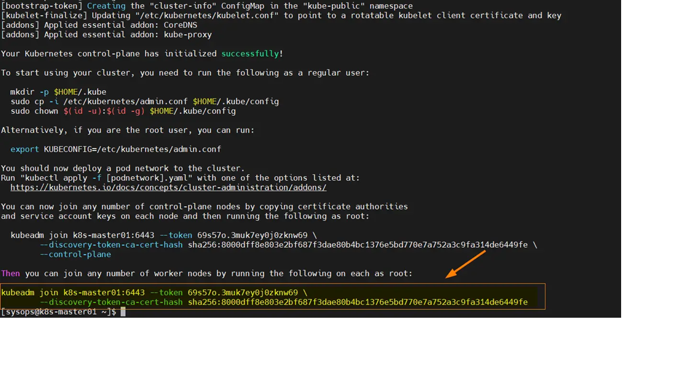
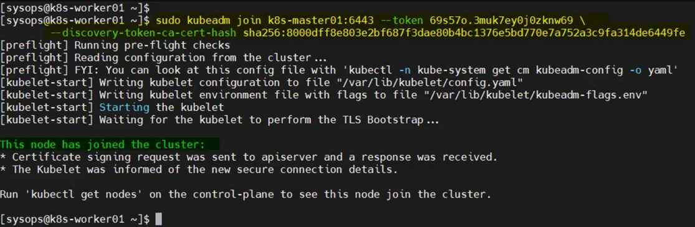

# Installing Kubernetes on Oracle Linux 9

## Part 1 - Setting Up Kubernetes Environment on All Nodes

- In this hands-on, we will prepare two nodes for Kubernetes on `Oracle Linux 9`. One of the node will be configured as the Master node, the other will be the worker node. Following steps should be executed on all nodes. *Note: It is recommended to install Kubernetes on machines with `2 CPU Core` and `2GB RAM` at minimum to get it working efficiently. 

- Explain briefly [required ports](https://kubernetes.io/docs/setup/production-environment/tools/kubeadm/install-kubeadm/)  for Kubernetes. 


- Name the second security group as worker-sec-group, and apply the following Worker Node(s) table to your worker nodes.

### Control-plane (Master) Node(s)

|Protocol|Direction|Port Range|Purpose|Used By|
|---|---|---|---|---|
|TCP|Inbound|6443|Kubernetes API server|All|
|TCP|Inbound|2379-2380|`etcd` server client API|kube-apiserver, etcd|
|TCP|Inbound|10250|Kubelet API|Self, Control plane|
|TCP|Inbound|10259|kube-scheduler|Self|
|TCP|Inbound|10257|kube-controller-manager|Self|
|TCP|Inbound|22|remote access with ssh|Self|
|UDP|Inbound|8472|Cluster-Wide Network Comm. - Flannel VXLAN|Self|

### Worker Node(s)

|Protocol|Direction|Port Range|Purpose|Used By|
|---|---|---|---|---|
|TCP|Inbound|10250|Kubelet API|Self, Control plane|
|TCP|Inbound|30000-32767|NodePort Services†|All|
|TCP|Inbound|22|remote access with ssh|Self|
|UDP|Inbound|8472|Cluster-Wide Network Comm. - Flannel VXLAN|Self|

## Step 1: Set Hostname and Update Hosts file
Login or ssh each machine and run hostnamectl commands to set their respective hostname.
```bash
sudo hostnamectl set-hostname “k8s-master01” && exec bash
sudo hostnamectl set-hostname “k8s-worker01” && exec bash
```
Add the following entries in /etc/hosts file on each node.
```bash
sudo vi /etc/hosts
192.168.1.190   k8s-master01
192.168.1.191   k8s-worker01
192.168.1.192   k8s-worker02
```

## Step 2: Disable Swap Space on Each Node

For kubelet to work smoothly, we must disable swap space on all the nodes. Run beneath command,
```bash
sudo swapoff -a
sudo sed -i '/ swap / s/^\(.*\)$/#\1/g' /etc/fstab
```

## Step 3: Adjust SELinux and Firewall Rules for Kubernetes

```bash
sudo setenforce 0
sudo sed -i --follow-symlinks 's/SELINUX=enforcing/SELINUX=permissive/g' /etc/sysconfig/selinux
```
In case of problem with firewall disable with following commands:
```bash
sudo systemctl stop firewalld
sudo systemctl disable firewalld
sudo systemctl status firewalld
```
On the master node, allow following ports in the firewall.
```bash
$ sudo firewall-cmd --permanent --add-port={6443,2379,2380,10250,10251,10252,10257,10259,179}/tcp
$ sudo firewall-cmd --permanent --add-port=4789/udp
$ sudo firewall-cmd --reload
```
On the Worker Nodes, allow beneath ports in the firewall,

```bash
$ sudo firewall-cmd --permanent --add-port={179,10250,30000-32767}/tcp
$ sudo firewall-cmd --permanent --add-port=4789/udp
$ sudo firewall-cmd --reload
```
## Step 4: Add Kernel Modules and Parameters

For kuberetes cluster, we must add the overlay and br_netfilter kernel modules on all the nodes.
Create a file and add following content to it,
```bash
$ sudo tee /etc/modules-load.d/containerd.conf <<EOF
overlay
br_netfilter
EOF
```
In order to load above modules, run
```bash
$ sudo modprobe overlay
$ sudo modprobe br_netfilter
```
Next, add the following kernel parameters, create a file and with following content,

```bash
$ sudo vi /etc/sysctl.d/k8s.conf
net.bridge.bridge-nf-call-iptables  = 1
net.ipv4.ip_forward                 = 1
net.bridge.bridge-nf-call-ip6tables = 1
```
Save & close the file.
Now add these parameters by running below command
```bash
$ sudo sysctl --system
```
## Step 5: Install Conatinerd Runtime
Kubernetes requires a container runtime, and one of the most popular choices is containerd. But It is not available in the default package repositories of Rocky Linux or AlmaLinux, so add the following docker repo on all the nodes.

```bash
$ sudo dnf config-manager --add-repo https://download.docker.com/linux/centos/docker-ce.repo
```
Now, run following dnf command to install containerd on all the nodes.
```bash
$ sudo dnf install containerd.io -y
```
Configure containerd so that it will use systemdcgroup, execute the following commands on each node.

```bash
$ containerd config default | sudo tee /etc/containerd/config.toml >/dev/null 2>&1
$ sudo sed -i 's/SystemdCgroup \= false/SystemdCgroup \= true/g' /etc/containerd/config.toml
```
Restart and enable containerd service using beneath commands,
```bash
$ sudo systemctl restart containerd
$ sudo systemctl enable containerd
```
Verify conatinerd service status, run
```bash
$ sudo systemctl status containerd
```
`
## Step 6: Install Kubernetes Tools
Kubernetes tools like Kubeadm, kubectl and kubelet are not available in the default package repositories of Rocky Linux 9 or AlmaLinux 9. So, to install these tools, add the following repository on all the nodes.
```bash
$ cat <<EOF | sudo tee /etc/yum.repos.d/kubernetes.repo
[kubernetes]
name=Kubernetes
baseurl=https://pkgs.k8s.io/core:/stable:/v1.28/rpm/
enabled=1
gpgcheck=1
gpgkey=https://pkgs.k8s.io/core:/stable:/v1.28/rpm/repodata/repomd.xml.key
exclude=kubelet kubeadm kubectl cri-tools kubernetes-cni
EOF
```
Note: At time of writing this post, Kubernetes 1.28 version was available, that’s why I have mentioned v1.28 while adding the repo.
Next, install Kubernetes tools by running following dnf command,
```bash
$ sudo yum install -y kubelet kubeadm kubectl --disableexcludes=kubernetes
```
After installing Kubernetes tools, start the kubelet service on each node.
```bash
$ sudo systemctl enable --now kubelet
```

## Step 7: Install Kubernetes Cluster on Oracle Linux / Rocky Linux 9 / Alma Linux 9

Now, we are all set to install Kubernetes cluster. Run beneath Kubeadm command to initialize the Kubernetes cluster from the master node.

```bash
$ sudo kubeadm init --control-plane-endpoint=k8s-master01
```


From the output above make a note of the command which will be executed on the worker nodes to join the Kubernetes cluster.

To start interacting with Kubernetes cluster, run the following commands on the master node.
```bash
$ mkdir -p $HOME/.kube
$ sudo cp -i /etc/kubernetes/admin.conf $HOME/.kube/config
$ sudo chown $(id -u):$(id -g) $HOME/.kube/config
```
Next, join the worker nodes to the cluster, run following Kubeadm command from the worker nodes.
```bash
$ kubeadm join k8s-master01:6443 --token 69s57o.3muk7ey0j0zknw69 \
  --discovery-token-ca-cert-hash sha256:8000dff8e803e2bf687f3dae80b4bc1376e5bd770e7a752a3c9fa314de6449fe
```

Now, head back to master node and run kubectl command to verify the nodes status.
```bash
$ kubectl get nodes
```
Output above shows that nodes is “NoteRead”, so to make the nodes status “Ready”, install Calico network addon or plugin in the next step.

## Step 8: Install Calico Network Addon
Calico network addon is required on Kubernetes cluster to enable communication between pods, to make DNS service function with the cluster and to make the nodes status as Ready.
In order to install calico CNI (Container Network Interface) addon, run following kubectl commands from the master node only.
```bash
$ kubectl apply -f https://raw.githubusercontent.com/projectcalico/calico/v3.26.1/manifests/calico.yaml
```
Verify calico pods status,
```bash
$ kubectl get pods -n kube-system
```
Next, verify the nodes status, this time nodes status should be in Ready State.
```bash
$ kubectl get nodes
```
Perfect, output above confirms nodes are in Ready state and can handle workload. Let’s test our Kubernetes installation the next step.

## Step 9: Test Kubernetes Cluster Installation
To test Kubernetes cluster installation, let’s try to deploy nginx based application using deployment. Run following kubectl commands,
```bash
$ kubectl create deployment web-app01 --image nginx --replicas 2
$ kubectl expose deployment web-app01 --type NodePort --port 80
$ kubectl get deployment web-app01
$ kubectl get pods
$ kubectl get svc web-app01
```
Try to access the application using nodeport “31121”, run following curl command,
```bash
$ curl k8s-worker01:31121
```
Great, above confirms that we can access our application web page. This also confirms that our Kubernetes cluster has been installed successfully.


### Problems and Solutions:
If you use load balancer or custom CIDR network use following command structure to initialize Cluster
```bash
>sudo kubeadm init --apiserver-advertise-address=<ip address of master node or lb name> --pod-network-cidr=10.244.0.0/16 --ignore-preflight-errors=NumCPU
```
> **Note**: There are a bunch of pod network providers and some of them use pre-defined `--pod-network-cidr` block. Check the documentation at the References part. 
- In case of problems, use following command to reset the initialization and restart from Part 2 (Setting Up Master Node for Kubernetes).
```bash
sudo kubeadm reset
```
> Note down the `kubeadm join ...` part in order to connect your worker nodes to the master node. Remember to run this command with `sudo`.

- Show the list of the pods created for Kubernetes service itself. Note that pods of Kubernetes service are running on the master node.
```bash
kubectl get pods -n kube-system
```
- Show the details of pods in `kube-system` namespace. Note that pods of Kubernetes service are running on the master node.
```bash
kubectl get pods -n kube-system -o wide
```
- Get the services available. Since we haven't created any services yet, we should see only Kubernetes service.
```bash
kubectl get services
```
- Show the list of the Docker images running on the Master node to enable Kubernetes service.
```bash
docker container ls
```

## Deploying a Simple Nginx Server on Kubernetes
- Check the readiness of nodes at the cluster on master node.
```bash
kubectl get nodes
```
- Show the list of existing pods in default namespace on master. Since we haven't created any pods, list should be empty.
```bash
kubectl get pods
```
- Get the details of pods in all namespaces on master. Note that pods of Kubernetes service are running on the master node and also additional pods are running on the worker nodes to provide communication and management for Kubernetes service.
```bash
kubectl get pods -o wide --all-namespaces
```
- Create and run a simple `Nginx` Server image.
```bash
kubectl run nginx-server --image=nginx  --port=80
```
- Get the list of pods in default namespace on master and check the status and readyness of `nginx-server`
```bash
kubectl get pods -o wide
```
- Expose the nginx-server pod as a new Kubernetes service on master.
```bash
kubectl expose pod nginx-server --port=80 --type=NodePort
```
- Get the list of services and show the newly created service of `nginx-server`
```bash
kubectl get service -o wide
```
- You will get an output like this.
```text
kubernetes     ClusterIP   10.96.0.1       <none>        443/TCP        13m    <none>
nginx-server   NodePort    10.110.144.60   <none>        80:32276/TCP   113s   run=nginx-server
```
- Open a browser and check the `public ip:<NodePort>` of worker node to see Nginx Server is running. In this example, NodePort is 32276.
- Clean the service and pod from the cluster.
```bash
kubectl delete service nginx-server
kubectl delete pods nginx-server
```
- Check there is no pod left in default namespace.
```bash
kubectl get pods
```
- To delete a worker/slave node from the cluster, follow the below steps.
  - Drain and delete worker node on the master.
  ```bash
  kubectl get nodes
  kubectl cordon kube-worker-1
  kubectl drain kube-worker-1 --ignore-daemonsets --delete-emptydir-data

  kubectl delete node kube-worker-1
  ```
  - Remove and reset settings on the worker node.

  ```bash
  sudo kubeadm reset
  ```
  
> Note: If you try to have worker rejoin cluster, it might be necessary to clean `kubelet.conf` and `ca.crt` files and free the port `10250`, before rejoining.
>
> ```bash
>  sudo rm /etc/kubernetes/kubelet.conf
>  sudo rm /etc/kubernetes/pki/ca.crt
>  sudo netstat -lnp | grep 10250
>  sudo kill <process-id>
>  ```


# References

- https://kubernetes.io/docs/setup/production-environment/tools/kubeadm/install-kubeadm/

- https://kubernetes.io/docs/concepts/cluster-administration/addons/

- https://kubernetes.io/docs/reference/

- https://kubernetes.io/docs/reference/generated/kubectl/kubectl-commands#-strong-getting-started-strong-
